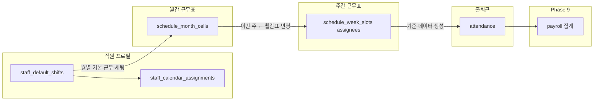

# 인력 관리: 근무표·출퇴근 데이터 흐름

> 작성·갱신: 2026-04-30  
> 상위 문서: [[설계-2026-04-29-v1.2]] · 프로토타입 `gelato-management-prototype-v1.5.html`

본 문서는 **직원 프로필 기본 근무 → 월간 근무표 → 주간 시간대표 → 출퇴근(예정·실적) → Phase 9 급여** 로 이어지는 데이터 파이프라인을 한 곳에서 정의한다. 구현 세부는 코드(`src/hooks/useStaff.ts`, `useMonthSchedule.ts`, `useWeekSchedule.ts`, `useAttendance.ts`, `StaffPage.tsx`)와 SQL (`supabase/sql/feature3_hr_tables.sql`)을 기준으로 한다.

---

## 요약 다이어그램

실선은 주 경로; 월간→주간 자동 배치는 앵커 슬롯 기준(`SHIFT_ANCHOR_SLOT_INDEX`)으로 구현됨.

---

## 레이어별 역할과 테이블

| 레이어       | 테이블·구조                                                 | 책임                                                                                                                                         |
| --------- | ------------------------------------------------------ | ------------------------------------------------------------------------------------------------------------------------------------------ |
| 기본 패턴     | `staff_default_shifts`                                 | 직원별 **요일 × 시프트(open/middle/close)** 다중 행. 소스 오브 트루스로서 «월 오픈, 화 오픈» 등 반복 패턴을 표현. UNIQUE `(staff_id, day_of_week, shift)`.                   |
| 직원 미니달력   | `staff_calendar_assignments`                           | **yyyymm + 일** 단위로 그 달만 덮어쓴 예정 시프트. 프로필과 달리 특정 월만 예외 두고 싶을 때.                                                                              |
| 월간 매장 뷰   | `schedule_month_cells`                                 | **날짜(work_date) × 직원 × 시프트**, 매장 전체 월간 근무표. «월별 기본 근무 세팅»은 프로필에서 이 테이블(및 아래 동기화)을 채운다. 직원·날짜당 **한 시프트**만 가능(UNIQUE `staff_id, work_date`). |
| 주간 시간 그리드 | `schedule_week_slots` + `schedule_week_slot_assignees` | **1시간 슬롯 × 요일** 그리드에 직원 배정. **예정 근무**를 시간 해상도로 표현; 프로토타입과 동일하게 주간이 출퇴근 «예상 시간»의 근거가 된다.                                                    |
| 출퇴근 실적    | `attendance`                                           | `check_in` / `check_out`, `is_baseline`(주간에서 생성된 예정치), 수기 수정 필드. 급여는 **실근무(실적)** 기준(Phase 9).                                              |

---

## 단계별 흐름

### 1) 프로필에서 기본 패턴 입력

- UI: 직원 상세의 근무요일·시프트 행 (`staff_default_shifts`).
- 같은 요일에 시프트가 여러 개면 여러 행으로 표현 가능(DB 제약상 동일 요일·동일 시프트만 금지).

### 2) 월 단위 계획 — «월별 기본 근무 세팅»

- 구현: `useApplyMonthDefaultFromProfiles` (`useMonthSchedule.ts`).
- 프로필을 해당 월의 달력 요일에 매핑해 `schedule_month_cells`에 INSERT, 같은 규칙으로 `staff_calendar_assignments`에도 반영.
- 월간 셀은 **날짜당 한 시프트**만 허용하므로, 같은 요일에 프로필에 여러 시프트가 있으면 **`pickShiftForWeekday`**: open → middle → close 순으로 **대표 한 개**만 반영된다. 이 규칙은 사용자에게 UI 카피로 이미 노출하는 것이 좋다.

### 3) 주 단위 예정 근무 — 주간 근무표

- 월간 `schedule_month_cells`는 근무표 탭에서 **칩 색(시프트)** 참조용으로 쓰일 수 있으나, 주간 슬롯 배정은 **수동 클릭**이 기본이고, **「이번 주 ← 월간표 반영」**으로 앵커 슬롯에 일괄 배정한 뒤 1~2시간 단위는 슬롯에서 조정한다.

### 4) 가게 영업 시간과 슬롯 라벨

- 현재: `WEEK_SLOT_LABELS`(09:00~22:00) 및 슬롯 인덱스→시각이 코드 상수로 고정(`dateUtils.ts`).
- 오픈/미들/마감을 **실제 시각**에 매기려면 매장 설정(상수 확장 또는 `stores`/별도 테이블)이 필요하다. Phase 8-1에서 옵션을 선택한다.

### 5) 기준 출퇴근 생성 («출퇴근 기준 데이터 생성»)

- 구현: `useGenerateAttendanceBaseline` (`useAttendance.ts`).
- 같은 날·같은 직원에 대해 배정된 슬롯 인덱스를 모아 **첫 슬롯 시작 시각 출근·마지막 슬롯 라벨+1h 퇴근**(프로토타입 v1.5와 동일). +8h 고정은 사용하지 않음.

### 6) 실제 출퇴근과 급여 경계

- Punch 및 수기 수정 → `attendance` 실적.
- **Phase 9**: `staff.hourly_rate`와 실근무 시간 집계로 `payroll` 등. 예정(`schedule_*`, baseline)은 비교·설명용이지 급여 산정의 1차 원천이 아니다.

### 7) 출퇴근 UI 정합

- 출퇴근 탭: `groupAttendanceByDateStaff`·`diffAttendance` 로 날짜·직원별 예정(기준) vs 실제, 5분 임계 지각/조퇴 표시.

---

## 현재 구현 갭 (체크리스트 Phase 8-1과 연계)

1. ~~월간 `schedule_month_cells` → 선택 주 `schedule_week_slots` **배정 보조**~~ — 구현됨(`useApplyWeekFromMonthCells`).
2. ~~기준 출퇴근 **첫/마지막 슬롯**~~ — 구현됨.
3. 매장별 오픈/미들/마감 시각 **DB 저장** — 선택 과제; 현재는 `SHIFT_ANCHOR_SLOT_INDEX` 상수.
4. ~~출퇴근 탭 예정 vs 실제~~ — 구현됨.
5. 직원 미니달력 vs 월간 매장 뷰 **테이블 통합** — 장기 과제; UI 안내로 역할 구분.

---

## Phase 9 경계

- 급여·정산 로직, OTP 수기 수정 전체 플로우는 본 문서 범위에서 **요구사항만 참조**하고, 구현은 [[체크리스트]] Phase 9 및 [[설계-2026-04-29-v1.2]] 출퇴근 수기 수정 절을 따른다.
